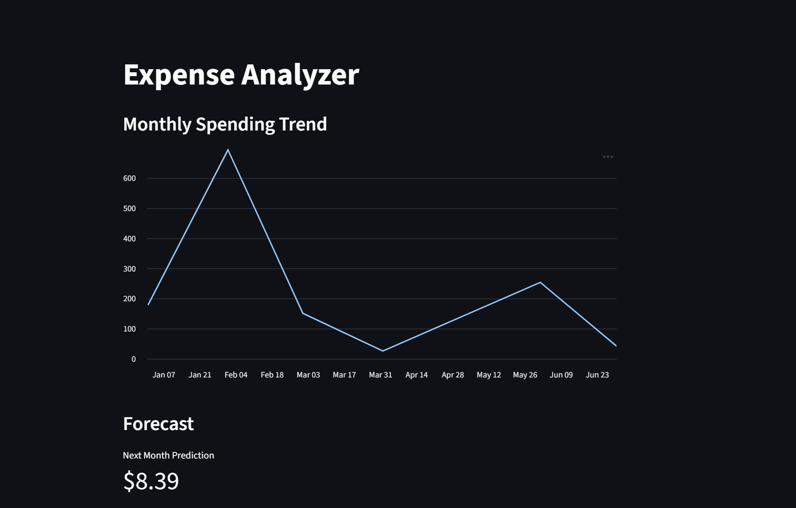

# Expense Analyzer & Forecasting Dashboard

## Overview
Expense Analyzer is a data analytics project that processes personal expense data stored in a PostgreSQL database to uncover spending patterns, detect anomalies, and forecast future expenses.  
The project combines SQL, Python data analysis, machine learning, and interactive visualization through a Streamlit dashboard.

This project was built to simulate a real-world data analytics pipeline rather than a toy example.

---

## Problem Statement
Tracking expenses manually provides limited insight into spending behavior over time.  
This project aims to:
- Identify where money is being spent
- Detect unusually high or low spending months
- Predict future spending trends using machine learning

---

## Tech Stack
- **Python**
  - pandas
  - scikit-learn
  - psycopg2
- **PostgreSQL**
- **SQL**
- **Streamlit**
- **Git**

---

## Architecture
PostgreSQL → pandas (ETL) → Data Analysis → ML Forecasting → Streamlit Dashboard

---

## Features
- Connects to PostgreSQL to retrieve expense data
- Cleans and processes raw SQL data using pandas
- Aggregates expenses by category and month
- Detects anomalous spending periods using statistical methods
- Forecasts next month's expenses using linear regression
- Interactive Streamlit dashboard for visualization

---

## Example Analyses
- Category-based spending breakdown
- Monthly spending trend visualization
- Anomaly detection for unusual months
- Machine learning-based spending forecast

---

## Getting Started

### 1. Clone the repository
```bash
git clone https://github.com/your-username/expense-analyzer.git
cd expense-analyzer
```
### 2. Install dependencies
```
pip install -r requirements.txt
```
### 3. Configure PostgreSQL
Create a PostgreSQL database and update the connection credentials in:
```
src/db/connection.py
```
### 4. Run the dashboard
```
streamlit run src/app.py
```

---

## Machine Learning

A linear regression model is used to forecast future monthly expenses based on historical spending trends.
This serves as a baseline model and can be extended with more advanced time-series techniques.

--- 

## Future Improvements
- Category-level forecasting
- Budget threshold alerts
- Advanced time-series models (ARIMA / LSTM)
- Deployment using Docker or cloud platforms

---

## Author

Built by [Vrospix]

---

## Screenshots

### Dashboard Overview

